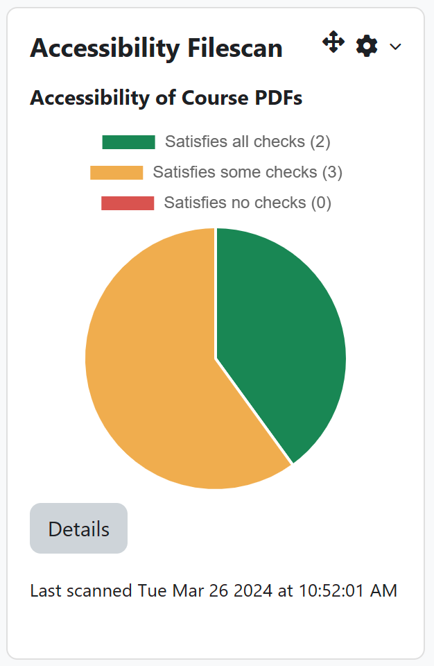
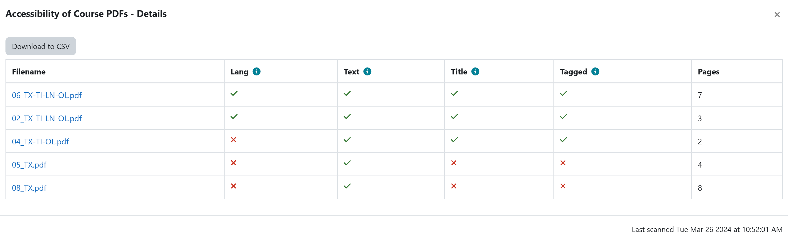

# moodle-block_accessibility_filescan

Moodle block plugin to display accessibility results from the [local_accessibility_filescan](https://github.com/Swarthmore/moodle-local_accessibility_filescan) Moodle plugin.

## Requirements

* Moodle 4.0+

## Installation

```bash
MOODLE_ROOT=/path/to/your/moodle
git clone https://github.com/aweed1/moodle-block_accessibility_filescan $MOODLE_ROOT/blocks/accessibility_filescan
```

## Configuration

There are configurations for help links for each type of accessibility problem.  These links can be set to specific URLs for remediation of the file.

## Screenshots




